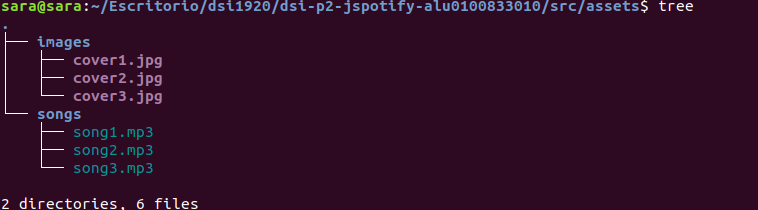
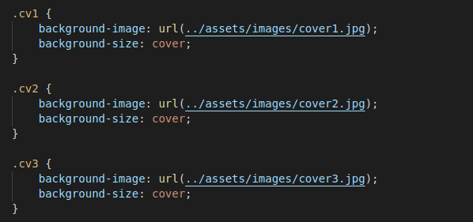
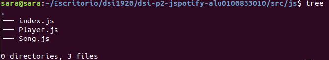
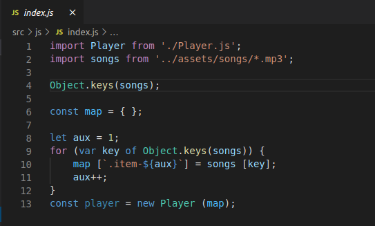
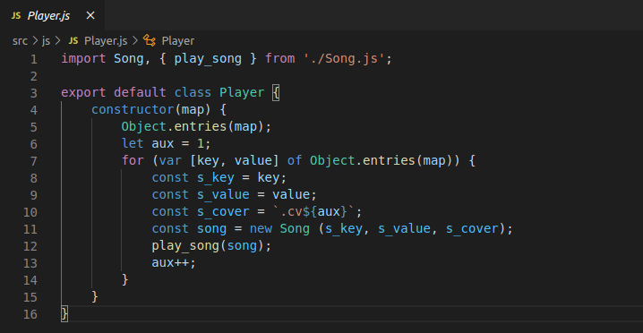
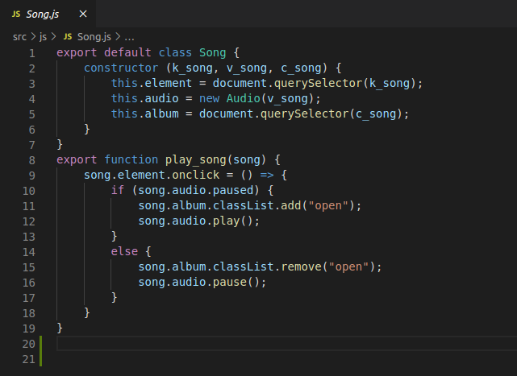
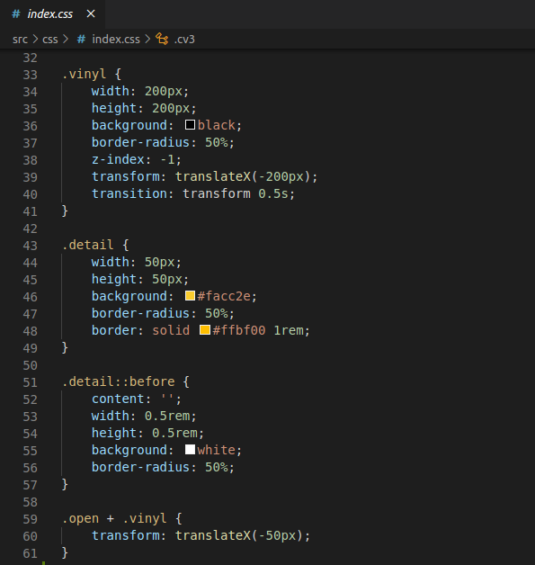
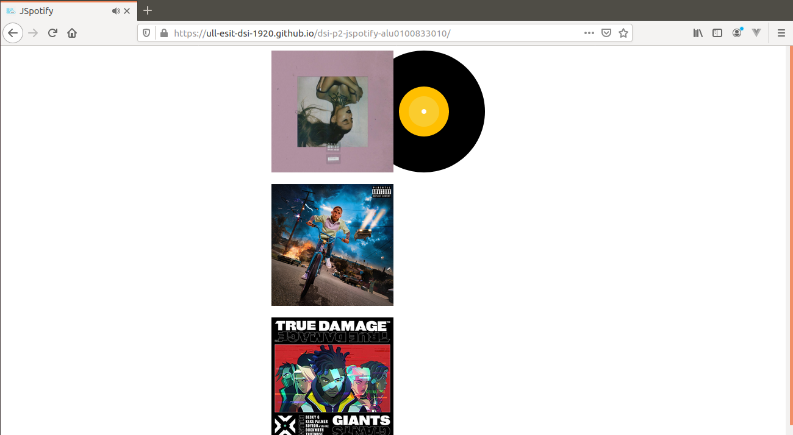

# dsi-p2-jspotify-alu0100833010

_Práctica 2.  Javascript + Multimedia._

## Descripción de la Práctica  dsi-p2-jspotify.

Los automatizadores permiten trabajar con herramientas avanzadas en nuestros proyectos,
de forma que sea más cómodo integrarlas en nuestro día a día.

El objetivo de la práctica es crear una página JavaSpotify con varios vinilos que reproduzcan una canción cuando pulses sobre
ellos.

## Comenzando

### 1. Crea un proyecto en _Parcel_.

Para comenzar la práctica  crearemos un proyecto con Parcel para poder trabajar y realizar la práctica. Para ello comenzamos
creando la estructura del proyecto .

#### Pasos para crear el proyecto.

* **Scaffolding** 

  Creamos las carpetas:
  ```
  mkdir -p nombre-repo/src/{css,js,assets}
  ```
  Nos situamos en el repo:
  ```
  cd nombre-repo
  ```
* **Git**

  Inicializamos el repo con git:
  ```
  git init
  git remote add origin...
  touch .gitignore
  touch README.md
  ```
* **NPM**

  Inicializamos el repo con npm:
  ```
  npm init -y
  ```
* **Instalación de ParcelJS**
  ```
  // Instalamos parcel en nuestro proyecto.
  npm install -D parcel-bundler
  
  // Punto de entrada para parcel.
  npx parcel src/index.html
  ```
* **Linters**
  ```
  npm install -D eslint
  ```
* **Formateador de código: Prettier**
  ```
  // Configurar nuestro proyecto para Prettier
  npm install -D prettier
  
  // Plugins para evitar conflictos entre Prettier y ESLint.
  npm install -D eslint-config.prettier eslint-plugin-prettier
  ```
  
  Tras esto, la estructura final del proyecto quedaría:
  
  
  
### 2. Carpeta _Assets_.

Busca varias canciones en formato MP3 y guárdalas en la carpeta assets. Haz lo mismo con varias imágenes para las carátulas de los
vinilos.

 
 
Para añadir las imágenes se ha usado la propiedad `background-image` desde CSS:

 
 
### 3. Código _HTML_.

En `index.html` debemos tener el mismo número de items que de imágenes de carátula y audios, por lo que el código inicial proporcionado hay que ampliarlo.

```
<div class="item item-1 flex">
  ...
</div>
<div class="item item-2 flex">
  ...        
</div>
<div class="item item-3 flex">
  ...       
</div>
```
### 4. Código _Javascript_.

Utilizando módulos de _Javascript_, creamos dos clases **Player** y **Song**:



* `index.js`:

 
 
 En `index.js` creamos el hash `map` que le pasamos a la clase **Player** que corresponden a cada una de las canciones que tenemos
 en la carpeta _/assets_ junto con la clase _HTML_ que lo representa. 
 
* `Player.js`:

 
 
 Se analizan los elementos que recibe el objeto `map` desde la clase **index**. Creamos un nuevo objeto `Song` que
 recibe `s_key` (clase _HTML_ que representa la canción), `s_value` (canción que tenemos en _/assets_) y un nuevo elemento
 `s_cover` (elemento que hace referencia a la carátula de la canción). Por último, llamamos a la función `play_song()` que está
 implementada en la clase **Song** y que es la responsable de reproducir la canción.
 
* `Song.js`:

 
 
 Se analizan los elementos que recibe el objeto `song` desde la clase **Player**. La función `play_song()` recibe la canción que
 se quiere reproducir y se activa mediante el evento `onclick`. Además, también se indica la carátula correspondiente para que,
 cuando se reproduzca la canción, se desplace el vinilo.
 
 Código _CSS_ del vinilo:
 
 
 
### 5. Publicación en _gh-pages_.
 
Para publicar nuestro proyecto en **gh-pages**, ejecutamos los siguientes comandos:
```
$ npx parcel build src/index.html --no-minify
$ npx parcel build src/index.html --no-source-maps --detailed-report
$ npx parcel build src/index.html --public-url /dsi-p2-jspotify-alu0100833010/ -d build
$ npx gh-pages -d build
```


Enlace:  https://ull-esit-dsi-1920.github.io/dsi-p2-jspotify-alu0100833010/
