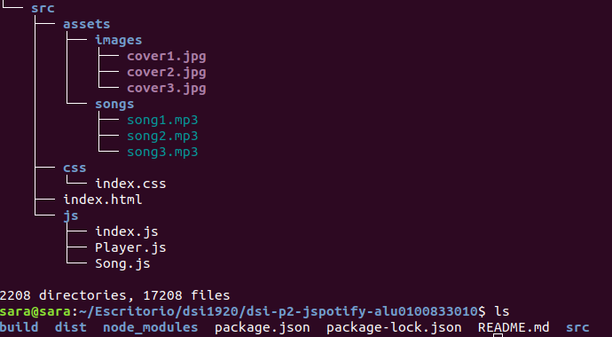

# dsi-p2-jspotify-alu0100833010

_Práctica 2.  Javascript + Multimedia._

## Descripción de la Práctica  dsi-p2-jspotify.

Los automatizadores permiten trabajar con herramientas avanzadas en nuestros proyectos,
de forma que sea más cómodo integrarlas en nuestro día a día.

El objetivo de la práctica es crear una página JavaSpotify con varios vinilos que reproduzcan una canción cuando pulses sobre ellos.

## Comenzando

### 1. Crea un proyecto en _Parcel_.

Para comenzar la práctica  crearemos un proyecto con Parcel para poder trabajar y realizar la práctica. Para ello comenzamos creando la estructura del proyecto .

#### Pasos para crear el proyecto.

* **Scaffolding** 

  Creamos las carpetas:
  ```
  mkdir -p nombre-repo/src/{css,js,assets}
  ```
  Nos situamos en el repo:
  ```
  cd nombre-repo
  ```
* **Git**

  Inicializamos el repo con git:
  ```
  git init
  git remote add origin...
  touch .gitignore
  touch README.md
  ```
* **NPM**

  Inicializamos el repo con npm:
  ```
  npm init -y
  ```
* **Instalación de ParcelJS**
  ```
  // Instalamos parcel en nuestro proyecto.
  npm install -D parcel-bundler
  
  // Punto de entrada para parcel.
  npx parcel src/index.html
  ```
* **Linters**
  ```
  npm install -D eslint
  ```
* **Formateador de código: Prettier**
  ```
  // Configurar nuestro proyecto para Prettier
  npm install -D prettier
  
  // Plugins para evitar conflictos entre Prettier y ESLint.
  npm install -D eslint-config.prettier eslint-plugin-prettier
  ```
  
  Tras esto, la estructura final del proyecto quedaría:
  
  
